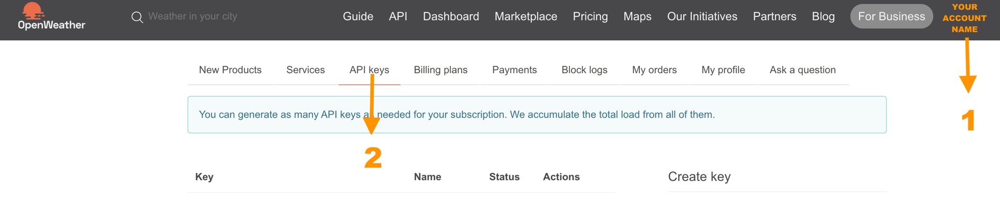
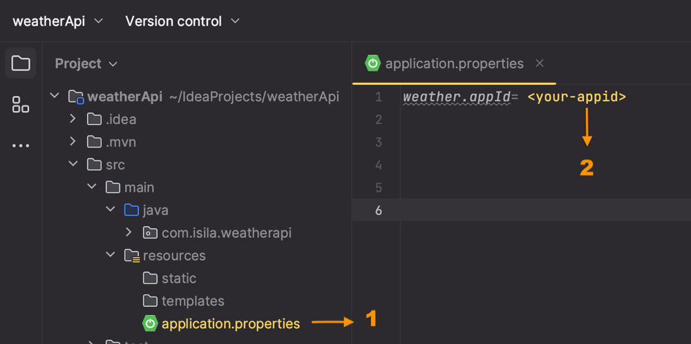

# 🌤️Weather and Air Pollution API 

## 📖 About this project 
- In this integration project, I tried to develop about the cities' and countries' 
weather and  air pollution information. You can learn any country's or city's weather and air pollution 
which you want to learn.
- It gives you immediate and exact information.

⚠️ But first you have to complete some steps. 

## 🛠️ Getting Started 
You must have  *appid*   which will help you to making requests
through this project. Here are the steps.

1. You have to register to the [weather map](https://openweathermap.org/).
2. Once you register to the systems, you have to click to your account and find your API key. Here is 
the explanation with the picture.
    
3. Next step is cloning my project.
4. When you clone the project to your local from my repository, you have to add your appid to the
application.properties file.This image can help you. 

- Now you are ready to run application 🚀. 
- Once you successfully run it, you can use [swagger](http://localhost:8080/swagger-ui.html) 
to making requests

## ℹ️ Api End-Point Explanations

- While the application is running, if you want to learn about any city's or country's air pollution and weather information you can directly make 
request to this end-points with [swagger](http://localhost:8080/swagger-ui.html)
  ### ⭐️ custom-air-pollution-and-weather-information-controller ⭐️️️
    - ✨ getCityInformation
      - #### You can also use curl request with your terminal,lets get the Istanbul's weather and air-pollution information 🙂    
             curl -X POST "http://localhost:8080/api/cityName" -H "accept: */*" -H "Content-Type: application/json" -d "{ \"cityName\": \"istanbul\"}"

    - ✨ getCountryInformation
      - #### Using curl request, get Türkiye's 🇹🇷 weather and air-pollution information
             curl -X POST "http://localhost:8080/api/countryName" -H "accept: */*" -H "Content-Type: application/json" -d "{ \"country\": \"turkey\"}"
  

#### 🔐 But if you want to go on a deep 🙂 here are some explanations about the end-points of the api.
### 📣  All the below responses values contain pure information about the weather and air-pollution. All of them were taken as they are from their base websites.
  
  ###  🟠 air-pollution-controller
   -  #### 🔸 getAirPollution ==> this end-point helps you to learn about the air-quality of the specific city or country. It return some special values that related with air-pollution 
        - It only accepts the coordinations. If you want to learn the exact
       coordinations of anywhere you can use below end-points.
          - for the city coordinations
            - weather-controller ==> getCoordinations
          - for the country coordinations
            - country-and-city-controller ==> getCountryCoordination
        - #### Using curl request, get Türkiye's air-pollution information
              curl -X POST "http://localhost:8080/api/airPollution" -H "accept: */*" -H "Content-Type: application/json" -d "{ \"lat\": 39, \"lon\": 35}"

  ###  🟠 country-and-city-controller
  -  #### 🔸 getAllCountries ==> gets all the countries in the world with their coordinations.
     - #### Using curl request
           curl -X GET "http://localhost:8080/api/countries" -H "accept: */*"
  -  #### 🔸 getCountriesWithCities ==> gets all countries with their cities in the world 
     - #### Using curl request
           curl -X GET "http://localhost:8080/api/countries/cities" -H "accept: */*"
  -  #### 🔸 getCountryCoordination ==> helps you to learn the coordinations of the specific Country
     - #### Using curl request, get Türkiye's coordinations.
           curl -X POST "http://localhost:8080/api/countries/country" -H "accept: */*" -H "Content-Type: application/json" -d "{ \"country\": \"turkey\"}"
  -  #### 🔸 getSpecificCountryCities ==> helps you to learn the cities of the specific Country
      - #### Using curl request,get Türkiye's cities
            curl -X POST "http://localhost:8080/api/countries/country/cities" -H "accept: */*" -H "Content-Type: application/json" -d "{ \"country\": \"turkey\"}"
  -  #### 🔸 getSingleCountryLanguageCode ==> helps you to learn the language code of the specific country. It returns 'Iso2' value which means language code of that country.
      - #### Using curl request,get Türkiye's language code
            curl -X POST "http://localhost:8080/api/countries/country/iso" -H "accept: */*" -H "Content-Type: application/json" -d "{ \"country\": \"turkey\"}"
  -  #### 🔸 getAllLanguageCodes ==> helps you to learn the language codes of the countries all over the world.
      - #### Using curl request, get all language codes
            curl -X GET "http://localhost:8080/api/countries/iso" -H "accept: */*"

  ### 🟠 weather-controller
  - #### 🔸 getCurrentWeatherWithCoordinations ==> you can learn any city's and country's weather information in detail. You just have to know about the coordinations of the places and you can learn them from these end-points
    - for the city coordinations
        - weather-controller ==> getCoordinations= If you want to learn about the city coordinations, you can use this end-point
    - for the country coordinations
      - country-and-city-controller ==> getCountryCoordination
    - units
      - It means in which format you want to learn about the weather temperature
        - METRIC ==> Temperature in Celcius
        - IMPERIAL ==> Temperature for Fahrenheit
        - STANDARD ==> Temperature in Kelvin. If you are not specify any other units,
  this is the default one.
        - It is optional, if you do not want to use it, you can delete it.
    - #### Using curl request, get Istanbul's weather information in METRIC(Celcius) unit with coordinations values
          curl -X POST "http://localhost:8080/api/weather" -H "accept: */*" -H "Content-Type: application/json" -d "{ \"lat\": 41, \"lon\": 29, \"units\": \"METRIC\"}"
            
  - #### 🔸 getCoordinations ==> You can get any city's coordinations.
    - #### Using curl request, get Istanbul's coordinations with city name
          curl -X POST "http://localhost:8080/api/weather/city" -H "accept: */*" -H "Content-Type: application/json" -d "{ \"cityName\": \"istanbul\"}"
  - #### 🔸 getCurrentWeatherWithCityName ==> You can get any city's weather information with city name at that moment.
    - #### Using curl request, get Istanbul's weather information in METRIC(Celcius) unit with city name
          curl -X POST "http://localhost:8080/api/weather/cityname" -H "accept: */*" -H "Content-Type: application/json" -d "{ \"cityName\": \"istanbul\", \"units\": \"METRIC\"}"
  - #### 🔸 getCurrentWeatherWithCityNameAndLanguage ==> At this end-point you can get the weather informations in custom languages. If you use 'tr', some informations will get in Turkish
    - if you do not know the country's language code, you can learn it from this end-point
      - country-and-city-controller
        - getSingleCountryLanguageCode ==> when you make request this end-point
                     ,response returns an **Iso2** value, this is your language code
        - If you want to see all countries' language-codes you can use below end-point
          - country-and-city-controller
                         - getAllLanguageCodes
    - #### Using curl request, get Istanbul's weather information in Turkish and temperature with METRIC(Celcius) by city name
          curl -X POST "http://localhost:8080/api/weather/cityname/lang" -H "accept: */*" -H "Content-Type: application/json" -d "{ \"cityName\": \"istanbul\", \"lang\": \"tr\", \"units\": \"METRIC\"}"

## 👩‍💻 Resources I Use 
* [Open Weather](https://openweathermap.org/)
* [Countries & Cities Api](https://documenter.getpostman.com/view/1134062/T1LJjU52#intro)

## 🌟 Technologies I Use 
* Spring-Boot 2.5
* Java 17
* Spring Web
* Lombok
* Swagger 2
* RestTemplate
* Maven
